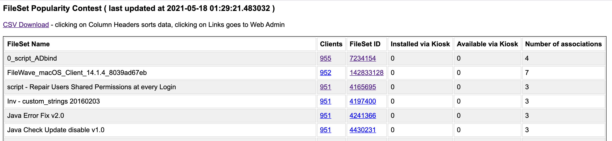

# FileSet Popularity Contest



Need an overview over how many of your clients have a certain fileset ?
This script extracts (Desktop) client information directly from the DB , and puts all the information 
into both a csv and a simple javascript-driven html page. 
The column headers on the html page are clickable and sort the data accordingly. 
Links on the "Clients" columnn auto-link to your FileWave (Web) admin to get a list of clients , 
and on the FileSet ID will show you the details of the FileSet / Payload in question . 

Usage : Run this on your v.14 Server on Linux or macOS , as a user that can write to 
your web admin directory. 
The script will give you the link to the resulting webpage.  

```/usr/local/filewave/python/bin/python ./fs-popularity.py```

Advanced Usage : Have a look at the variables in the 

If you want a version of that webpage that is regularly updated, schedule a cronjob .


