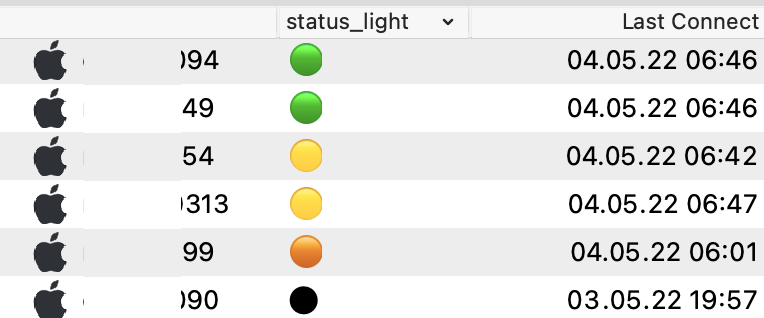
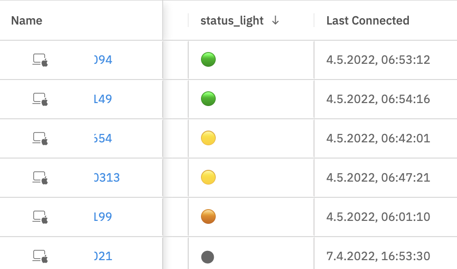

# status-lights

A simple indication on which clients are active, codified in colours.  

## Installation 

  1. Create a custom field called status\_light, or import the custom field from status\_light.customfields in this directory. 
  2. Copy the python script to your filewave server.
  3. Configure secrets.json to contain a valid inventory token and your server's address. 

## Usage
Run :

    /usr/local/filewave/python/bin/python /root/status-lights/status-lights.py
    
then add the status_light custom field to your FileWave Admin or Web Admin Clients view.

## Customisation

You can define colors as well as timespans those are applied to as follows :
More colors here : [https://www.compart.com/en/unicode/search?q=large+green+circle](https://www.compart.com/en/unicode/search?q=large+green+circle)

    green=chr(128994)
    yellow=chr(128993)
    orange=chr(128992)
    red=chr(128308)
    black=chr(11044)
    
    
To change interval lenghts, change the minimum and maximum boundaries ( in minutes ) below :

    intervals=((green,0,3),(yellow,3,30),(orange,30,60),(red,60,180),(black,-1,-1))

## Useful Parameters ( edit the script to modify those )

    VERBOSE = True ( False is default - script only reports errors when configured to False )

## Cronjob Example - run it every minute ( via crontab -e as root )

    * * * * * /usr/local/filewave/python/bin/python /root/status-lights/status-lights.py
